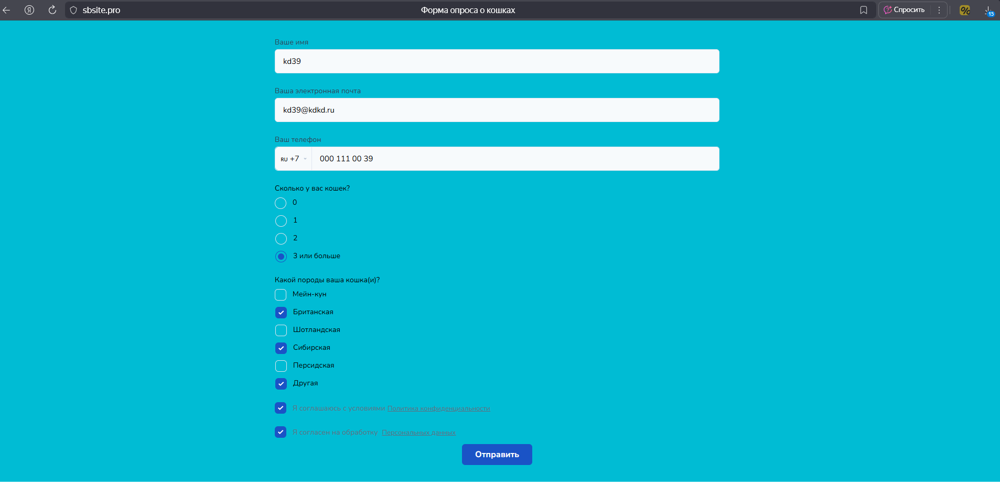
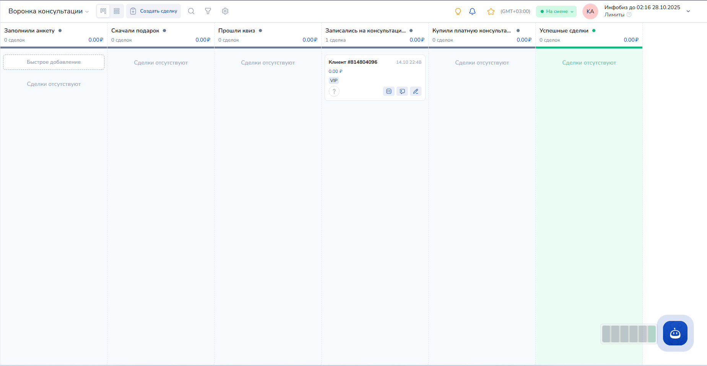
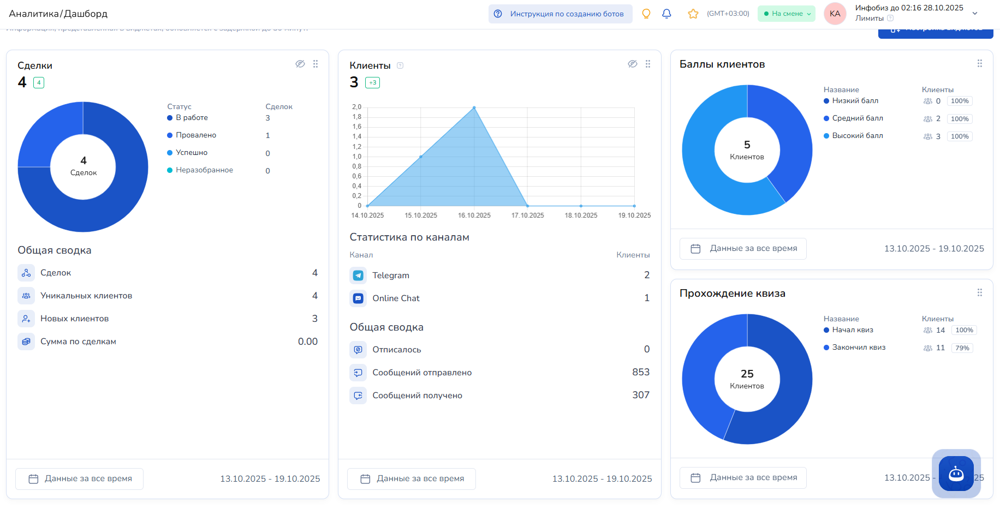

# 🐱 **Ваша Кошка — Чат-бот для пет-сервиса**

> *Telegram-бот на Salebot, который привлекает клиентов через образовательный квиз и ведёт к консультации с менеджером*

---

## 📌 Обзор проекта

**«Ваша Кошка»** — это интерактивный чат-бот в Telegram, созданный на платформе **Salebot**, чтобы помочь пет-сервису эффективно взаимодействовать с потенциальными клиентами. Бот сочетает обучение, персонализацию и мягкое вовлечение: он предлагает полезные материалы, проводит увлекательный квиз и мягко ведёт пользователя к записи на консультацию.

Проект ориентирован на владельцев кошек и будущих клиентов сервиса по уходу за питомцами, помогая им получить ценность уже на первом контакте.

🔗 [Открыть бота в Telegram](https://t.me/kdr_catcare_bot)

---

## 🎯 Цели проекта

- ✅ Привлечь внимание целевой аудитории (владельцы кошек)
- ✅ Предоставить ценность с первого сообщения
- ✅ Собрать контакты заинтересованных пользователей
- ✅ Оценить уровень знаний клиентов через квиз
- ✅ Направить клиентов на консультацию к менеджеру
- ✅ Автоматизировать процесс лидогенерации

---

## 🧩 Функциональные возможности

### 1. **Приветствие нового пользователя**
При первом запуске бот:
- Дружелюбно приветствует
- Рассказывает о себе и целях сервиса
- Предлагает начать с получения подарка или прохождения квиза

---

### 2. **Подарок за подписку**
- 🎁 Пользователь может скачать **PDF-файл с полезными рекомендациями** для владельцев кошек  
- Если пользователь уже получал файл ранее — бот не дублирует его, но предлагает **указать день рождения**, чтобы поздравить в нужную дату

> 📆 Возможность персонализированных поздравлений повышает лояльность и вовлечённость

---

### 3. **Интерактивный квиз "Насколько вы хороший хозяин?"**
- 🔍 Квиз включает вопросы по уходу, питанию, поведению и здоровью кошек
- 💬 Вопросы подаются в формате чата с вариантами ответов
- 🎯 После каждого ответа — краткая обратная связь
- 📊 В конце квиза:
  - Отображается **итоговый счёт (в баллах)**
  - Предлагается **посмотреть правильные ответы**
  - Даётся мягкий call-to-action: записаться на консультацию

---

### 4. **Запись на консультацию**
- ✅ При согласии: бот переходит к анкетированию и переводит на **лендинг сервиса**
- ❌ При отказе: дружелюбно прощается и оставляет дверь открытой:  
  > _"Если передумаете — просто напишите «Консультация», и я всё организую!"_

---

## 📝 Анкетирование клиента

Анкета реализована на внутреннем мини-лендинге Salebot и включает:

### 📱 Контактные данные (обязательные):
- ФИО
- Номер телефона (**с валидацией формата**)
- E-mail (**с проверкой корректности**)

### 🐾 Информация о питомце:
- Имя кошки/кота
- Возраст
- Особенности характера или здоровья (по желанию)

### 🔐 Юридические соглашения:
- [Согласие с Политикой конфиденциальности](https://example.com/privacy)  
- [Согласие на обработку персональных данных](https://example.com/pd-consent)  
(Оба — активные ссылки на документы)

---

## ⚙️ Техническая реализация

| Компонент | Описание |
|---------|--------|
| **Платформа** | [Salebot](https://salebot.pro/) — конструктор чат-ботов |
| **Мессенджер** | Telegram |
| **Формат контента** | Текст, кнопки, PDF-файлы, внешние ссылки |
| **Хранение данных** | Встроенная CRM Salebot |
| **Автоматизация** | Ветвящиеся сценарии, триггеры, метки |

---

## 🔄 Интеграция с CRM Salebot

Бот полностью интегрирован с CRM-системой Salebot:

- ✅ Все действия пользователя отслеживаются как **этапы сделки**
- ✅ Автоматическое присвоение **меток**:
  - `получил_подарок`
  - `прошёл_квиз`
  - `высокий_балл`
  - `записался_на_консультацию`
- ✅ Данные из анкеты попадают в карточку клиента

---

## 📊 Аналитика и отчётность

В дашборде Salebot настроены ключевые виджеты:

| Диаграмма | Описание |
|---------|----------|
| **Сделки** | Количественный и денежный оборот по стадиям |
| **Клиенты** | Общее количество и динамика роста |
| **Набранные баллы** | Распределение результатов квиза — показывает уровень осведомлённости аудитории |
| **Конверсия квиза** | % пользователей, дошедших до конца квиза и последующих действий |

---

## 🖼️ Скриншоты интерфейса

Внешний вид анкеты


Панель CRM


Дашборд с диаграммами



Чтобы добавить скриншоты в `README.md` и ограничить ширину изображений до **400 пикселей**, используйте HTML:

```html


```

> 📂 **Как добавить скриншоты на GitHub**:
> 1. Создайте папку `screenshots/`, добавив файл `screenshots/.gitkeep`
> 2. Загрузите PNG/JPG-файлы в эту папку через "Upload files"
> 3. Обновите пути в тегах `` на актуальные имена файлов

---

## 🚀 Преимущества проекта

| Преимущество | Описание |
|--------------|----------|
| 🧠 **Образовательный подход** | Квиз вовлекает и повышает доверие |
| 🎁 **Ценность сразу** | Подарок мотивирует остаться в диалоге |
| 🤖 **Автоматизация** | Полностью автономный процесс от первого сообщения до заявки |
| 📈 **Глубокая аналитика** | Понимание поведения аудитории и оптимизация воронки |
| 💬 **Персонализация** | Поздравления с ДР, адаптивные сценарии |

---

## 📅 План развития

| Этап | Улучшение |
|------|-----------|
| v1.1 | Рассылка напоминаний о визитах и ДР |
| v1.2 | Интеграция с календарём менеджера (типа Calendly) |
| v1.3 | Генерация персонального "паспорта кошки" |
| v2.0 | Поддержка нескольких языков и регионов |

---

## 📬 Контакты

По вопросам сотрудничества, доработки или тестирования:  
📧 e-mail: kagirovd4@yandex.ru 
Telegram: https://t.me/kagirovd_b

Телеграм-бот доступен по ссылке:
[https://t.me/kdr_catcare_bot](https://t.me/kdr_catcare_bot)
---

> ❤️ **"Ваша Кошка" — потому что забота начинается с понимания.**


